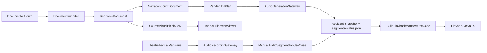

# Referencia tecnica de arquitectura local - DocuPodcast Studio

Fecha de registro: 2026-06-18.

Esta referencia describe el estado observado en el codigo local de `src/main/java/com/marcosmoreiradev/docupodcaststudio` y la documentacion vigente de `DOCUMENTACION_ACTUAL/`. No reemplaza el codigo como fuente primaria. Cuando un punto no pudo comprobarse en esta pasada, se marca como `no verificado`.

## 1. Vision general

DocuPodcast Studio es una aplicacion JavaFX local para importar documentos, preparar lectura narrable, generar o asociar audio por fragmentos/chunks, reproducir el documento sincronizado y producir salidas de audio/video. El proceso visible permanece en desktop: los motores locales se invocan como procesos, no como servidores HTTP publicos.

Puntos verificados:

- Entrada principal: `DocuPodcastStudioApp`.
- Fachada de servicios: `ApplicationServices`.
- Shell principal: `DocuPodcastShellView` y `DocuPodcastShellViewModel`.
- Persistencia de jobs de audio: `AudioJobFileRepository` bajo `jobs/JOB-*`.

## 2. Capas principales

La separacion esperada esta protegida por `ArchitectureBoundaryTest`:

- `domain`: modelos y reglas sin JavaFX ni infraestructura.
- `application`: casos de uso, puertos y coordinacion sin JavaFX.
- `infrastructure`: adaptadores de filesystem, Java Sound, procesos, settings y runtime local.
- `presentation`: JavaFX, coordinadores de shell y componentes visuales.
- `bootstrap`: ensamblaje de dependencias concretas.

No verificado: cobertura completa de todos los subpaquetes antiguos frente a esta regla; la prueba de arquitectura cubre limites principales.

## 3. Flujo Word/documento a playback

El flujo observado es:

1. Importadores (`DocxDocumentImporter`, `PdfDocumentImporter`, `MarkdownDocumentImporter`, `PlainTextDocumentImporter`) producen `ReadableDocument`.
2. `BuildPreparedReadingProjectionUseCase` y `BuildNarrationScriptUseCase` producen `NarrationScriptDocument`.
3. `BuildNarrationRenderPlanUseCase` y `BuildRenderUnitPlanUseCase` pueden convertir segmentos en unidades narrativas/renderizables.
4. `SubmitAudioGenerationJobUseCase` genera chunks WAV por unidad/segmento.
5. `BuildPlaybackManifestUseCase` construye `PlaybackManifest` desde `AudioJobSnapshot`.
6. `PlaybackTransportCoordinator` reproduce y sincroniza cues.

## 4. Chunks y reanudacion

El contrato persistente esta en:

- `AudioJobSnapshot`: estado global del job.
- `AudioSegmentSnapshot`: estado por chunk (`PENDING`, `GENERATING`, `COMPLETED`, `FAILED`, `CANCELLED`).
- `segments-status.json`: estado portable por segmento.

La reanudacion conserva segmentos `COMPLETED` y reinicia fallidos/cancelados/generando como pendientes para volver a intentar. En la mejora registrada el motor real pasa a 4 intentos totales por chunk (`maxRetries=3`) y el camino segmento por segmento continua con los siguientes chunks aunque un segmento agote intentos.

## 5. TTS local y Python

La generacion real se concentra en `LocalTtsProcessAudioGenerationGateway` y `LocalTtsProcessConfiguration`. El comando final se arma con placeholders como `{textFile}`, `{outputFile}`, `{voiceProfileId}` y rutas de muestra de voz.

Puntos verificados:

- `SettingsAwareAudioGenerationGateway` selecciona mock, Piper, XTTS o proceso externo desde settings.
- `DefaultExternalProcessRunner` ejecuta procesos y captura stdout/stderr con cancelacion.
- `LocalTtsProcessConfiguration` normaliza `--model-dir` / `-ModelDir` para evitar pasar `model.pth` como directorio de modelo XTTS.
- El modo XTTS batch usa `xtts-batch-manifest.json` para sintetizar multiples segmentos con una carga de modelo.

No verificado: rendimiento real de cada modelo local en CPU/GPU en esta pasada.

## 6. Imagenes

Las imagenes del documento se conservan como evidencia visual, no como asignacion automatica de storyboard. `DocxDocumentImporter` puede guardar `embeddedImageBase64` y `SourceVisualBlockView` renderiza la vista embebida.

Mejora registrada:

- `ImageFullscreenViewer` es el visor transversal.
- `SourceVisualBlockView.embeddedImage` agrega boton `AppIcon.FULLSCREEN`.
- Las imagenes embebidas se abren desde `Image` ya decodificada, sin archivo temporal obligatorio.

## 7. Persistencia local

Persistencia observada:

- Proyecto: repositorios bajo application/infrastructure project.
- Document workspace: `ReadableDocumentWorkspaceRepository`.
- Guion: `NarrationScriptWorkspaceFileRepository`.
- Storyboard: `StoryboardWorkspaceFileRepository`.
- Voces: `VoiceLibraryWorkspaceFileRepository` y `LocalVoiceSampleFileRepository`.
- Jobs de audio: `AudioJobFileRepository`.
- Settings operativos: `PropertiesOperationalSettingsRepository`.

No verificado: formato completo de todos los JSON historicos de proyecto fuera de los contratos leidos.

## 8. Procesos largos

Hay dos contratos relevantes:

- Audio jobs persistidos (`AudioJobSnapshot`) para TTS/chunks.
- Procesos comunes (`ProcessJobSnapshot`, `ExternalProcessRunner`) para procesos externos auditable/cancelables.

`AudioStatusUiThrottle` reduce actualizaciones frecuentes hacia JavaFX. `DefaultExternalProcessRunner` destruye arboles de procesos al cancelar.

## 9. UI JavaFX

La UI esta organizada como shell + workspaces + componentes:

- `DocuPodcastShellViewModel` concentra mucho estado transversal y sigue siendo un hotspot.
- `DocumentWorkspaceView` virtualiza/renderiza ventanas de documentos grandes.
- `TheatreTextualMapPanel` usa `TheatreTextSequenceCanvas` para intervenciones.
- `VoiceLibraryWorkspaceView` administra voces y muestras.

Mejora registrada:

- Click derecho en una intervencion del mapa textual abre accion de grabacion humana.
- Dialogo permite seleccionar microfono, iniciar/detener, escuchar y eliminar.

## 10. Extensibilidad

Extensiones naturales y verificadas:

- Nuevo motor TTS: implementar/seleccionar gateway o command template compatible con `AudioGenerationGateway`.
- Nuevo importador: implementar `DocumentImporter`.
- Nuevo asset: registrar `ProjectAssetReference` con `ProjectAssetKind`.
- Nuevo proceso externo: usar `ExternalProcessRunner` y mapear a `ProcessJobSnapshot` si debe aparecer como proceso largo.

No verificado: estabilidad binaria de APIs publicas para plugins externos; el proyecto se observa como app local, no como SDK.

## 11. Deuda tecnica observada

Deuda principal:

- `DocuPodcastShellViewModel` es muy grande y mezcla flujos de documento, audio, voces, teatro, export y estado UI.
- Algunas pruebas son de fuente/cadena para proteger regresiones visuales o wiring, utiles como guardarrail pero menos robustas que pruebas de comportamiento.
- Persistencia de audio manual reutiliza `AudioSegmentSnapshot` sin nuevo campo de origen; se distingue por ruta `*-manual.wav`.
- Hay documentacion historica abundante fuera de `DOCUMENTACION_ACTUAL/`, que no debe gobernar decisiones nuevas.

## 12. Limitaciones y riesgos

- Un job puede quedar `FAILED` con muchos chunks completados; playback puede usar los completados, pero exportacion final completa exige resolver pendientes.
- La grabacion manual depende de Java Sound y de que el sistema exponga `TargetDataLine` compatible con PCM WAV 16 kHz mono.
- En documentos con render units multiples por segmento, el audio manual por `segmentId` puede actuar como fallback de segmento; comportamiento por unidad fina: no verificado.
- XTTS/Piper dependen de rutas runtime/modelos locales; cambios manuales en settings pueden reintroducir rutas antiguas.

## 13. Mapa de componentes

