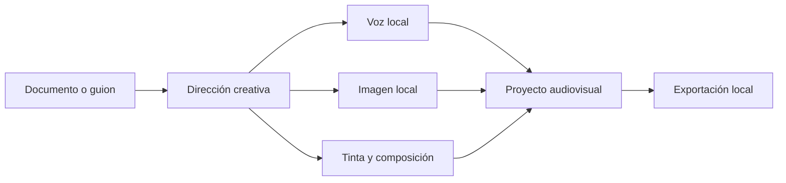

<p align="center">
  
</p>

<h1 align="center">DocuPodcast Studio</h1>

<p align="center">
  <strong>Del documento a una experiencia audiovisual. En tu equipo, bajo tu dirección.</strong>
</p>

<p align="center">
  
  
  
  
  
</p>

---

## Las ideas no nacieron para quedarse atrapadas en un archivo

Una investigación, un guion o un material de estudio puede ser mucho más que texto en una pantalla. **DocuPodcast Studio** es un entorno de producción audiovisual de escritorio que reúne lectura documental, narración, diseño visual, dirección escénica, tinta digital y exportación multimedia en un solo flujo creativo.

La propuesta es sencilla: conservar la profundidad de la fuente, darle una voz y convertirla en una experiencia que pueda estudiarse, escucharse, presentarse o publicarse.

No es una interfaz que delega la creación a una nube. Es un estudio **local-first**: el proyecto, los medios y los motores permanecen bajo control del usuario. Durante la operación normal, la generación de voz, imagen y video no depende de una API de Internet.

## Tres estudios, una misma visión

| Experiencia | Para qué sirve | Qué aporta |
|---|---|---|
| **Documentary Studio** | Transformar documentos DOCX y PDF en materiales narrados y audiovisuales. | Conserva la estructura documental, permite asignaciones visuales, resolución gráfica de problemas, narración y exportación final. |
| **Narrative Video** | Llevar un guion o relato a una línea audiovisual coherente. | Organiza contexto narrativo, medios, tomas, clips, voz e imágenes sin depender de la infraestructura específica de Teatro. |
| **Theatre** | Diseñar historias como puestas en escena. | Modela actos, escenas, intervenciones, personajes, voces, fondos, utilería, cámara, storyboards e imágenes intermedias. |

## Una cadena creativa completa

- **Lectura con estructura:** importa DOCX y PDF sin reducirlos a un bloque de texto plano.
- **Voz local:** integra Piper para una ruta ligera y XTTS para narración avanzada y voces de referencia.
- **Imagen generativa local:** coordina ComfyUI mediante workflows y paquetes de modelos administrados desde el propio producto.
- **Dirección visual:** vincula fragmentos, personajes, referencias, encuadres, fondos y recursos visuales con el contexto que les da sentido.
- **Tinta digital:** incorpora lienzos, composición y entrada de lápiz o mouse para explicar, bosquejar y resolver visualmente.
- **Video transversal:** utiliza FFmpeg y FFprobe para preparar, validar y renderizar entregables audiovisuales.
- **Biblioteca de voces:** administra perfiles, muestras y presets expresivos dentro de la experiencia de producción.
- **Proyectos portables:** guarda la estructura en `.docupodcast.json` y mantiene los medios relativos junto al proyecto.
- **Trabajo recuperable:** las tareas largas ofrecen progreso, cancelación y diagnósticos en lugar de ocultar procesos del sistema.

## Privacidad y soberanía creativa



Los motores se ejecutan como procesos locales desacoplados. La aplicación conserva la coordinación, la persistencia y la experiencia de usuario; Piper, XTTS, ComfyUI y FFmpeg realizan el trabajo especializado. Esta separación permite auditar cada componente, sustituir motores y mantener los archivos creativos fuera de servicios remotos.

> Las descargas iniciales, la preparación de runtimes o la obtención de modelos pueden requerir Internet. La operación creativa normal está diseñada para ejecutarse localmente.

## Estado del producto

DocuPodcast Studio se encuentra en **desarrollo activo**. Las tres categorías de proyecto funcionan y el trabajo actual se concentra en consolidar sus flujos, reducir deuda de interfaz y fortalecer la productización para Windows.

La compatibilidad de los proyectos existentes es una prioridad: las refactorizaciones deben preservar el formato `.docupodcast.json`, los medios relativos y los ejemplos oficiales.

### Lo que no viene dentro del repositorio

Este repositorio contiene código, pruebas, documentación, scripts, manifiestos, workflows, licencias y ejemplos de producto. Por tamaño y condiciones de redistribución, **no versiona**:

- pesos de modelos de voz o imagen;
- instalaciones locales de ComfyUI, Piper, Tesseract o FFmpeg;
- entornos Python y cachés de paquetes;
- grabaciones temporales y configuración específica de una máquina.

El contrato esperado de los componentes locales está documentado en [`runtime/local-runtime-manifest.json`](runtime/local-runtime-manifest.json).

## Requisitos de desarrollo

- Windows x86-64.
- Eclipse Temurin JDK 21.
- Maven 3.9 o una instalación compatible con Maven Toolchains.
- JavaFX 21, resuelto por Maven.
- Motores locales solo para probar generación y exportaciones reales.

La plantilla del toolchain está en [`.mvn/toolchains.xml.example`](.mvn/toolchains.xml.example).

## Construir y ejecutar

```bash
git clone https://github.com/marcos-moreira-dev/DocuPodcast-Studio.git
cd DocuPodcast-Studio

mvn -q test
mvn clean package
mvn -pl studio-launcher -am -DskipTests install
mvn -f studio-launcher/pom.xml javafx:run
```

En Windows también puedes usar los accesos preparados:

```bat
scripts\00-verificar-entorno.bat
scripts\02-ejecutar-tests.bat
scripts\01-ejecutar-app.bat
```

Para validar los runtimes instalados sin modificar el workspace:

```powershell
.\scripts\maintenance\audit-local-runtime.ps1
.\scripts\maintenance\clean-workspace.ps1
```

`clean-workspace.ps1` funciona en modo simulación salvo que se indique `-Apply`. No uses `git clean -xfd`: los motores y pesos locales están ignorados intencionalmente.

## Arquitectura

```text
presentation  -> JavaFX, vistas, SideDocks, ribbon, tinta y componentes
application   -> casos de uso, coordinación y puertos
domain        -> reglas de proyecto, documento, voz, visual, video y teatro
infrastructure-> persistencia, procesos locales, medios e importación/exportación
bootstrap     -> composición de servicios y arranque
```

Las categorías comparten contratos transversales de audio, imagen y video, pero mantienen workflows explícitos. Documentary y Narrative no dependen de implementaciones internas de Theatre.

Consulta la [visión de arquitectura](docs/architecture/overview.md), el [roadmap del refactoring](docs/architecture/refactoring-roadmap.md) y la [decisión local-first](docs/adr/0001-local-first-runtimes.md).

## Mapa del repositorio

| Ruta | Contenido |
|---|---|
| `src/main/java` | Código de producción organizado por capas. |
| `src/test/java` | Pruebas unitarias, de integración, arquitectura y comportamiento. |
| `src/main/resources/examples` | Proyectos oficiales incluidos en la experiencia. |
| `docs` | Documentación vigente de producto, arquitectura y operaciones. |
| `scripts` | Preparación, diagnóstico, smoke tests, empaquetado y release candidate. |
| `runtime` | Contratos y manifiestos de los motores locales. |
| `models` | Metadatos versionados y pesos locales ignorados. |
| `tools` | Wrappers versionados y runtimes de terceros ignorados. |
| `packaging/windows` | Identidad visual e iconos para app-image, MSI y distribución portable. |

## Validación y release

La ruta mínima de calidad es:

```bash
mvn -q test
mvn clean package
```

Antes de una entrega instalable se auditan runtimes, motores y licencias, se ejecutan ejemplos de las tres categorías y se prueban exportaciones de Documentary, Narrative y Theatre. Los scripts `13-*` a `16-*` automatizan la revalidación, app-image, MSI y release candidate.

Consulta la guía de [smoke y release](docs/operations/smoke-and-release.md) para el recorrido completo.

## Documentación

- [Índice general](docs/README.md)
- [Estado actual del producto](docs/product/current-status.md)
- [Arquitectura](docs/architecture/overview.md)
- [Roadmap del refactoring](docs/architecture/refactoring-roadmap.md)
- [Distribución de runtimes](docs/architecture/runtime-layout.md)
- [Motores locales](docs/operations/local-engines.md)
- [Build y pruebas](docs/development/build-test.md)
- [Catálogo de scripts](scripts/README.md)

---

<p align="center">
  <strong>DocuPodcast Studio</strong><br>
  Investigar. Narrar. Visualizar. Dirigir. Publicar.
</p>
