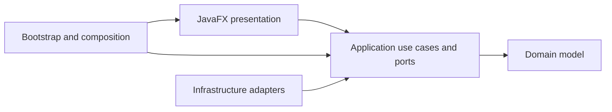

# Architecture overview

DocuPodcast Studio follows a layered local application architecture.

## Boundaries

- `domain` contains project, document, audio, visual, voice and theatre rules. It must not depend on JavaFX or infrastructure.
- `application` coordinates use cases and declares ports. It must not depend on JavaFX.
- `infrastructure` implements persistence, local process, media and import/export ports.
- `presentation` owns JavaFX views, view models and reusable GUI components.
- `bootstrap` is the composition root and may wire all layers.

Product-category workflows are explicit. Documentary, Narrative and Theatre may share transversal audio/video contracts, but Documentary and Narrative must not import Theatre implementation classes.

Project persistence is backward compatible. Refactors must preserve `.docupodcast.json`, relative project assets and existing example projects unless a separate migration is designed and tested.

## Long-running work

TTS, image generation and video rendering use local process abstractions with progress, cancellation and diagnostics. Views do not invoke operating-system processes directly.

## Presentation

Reusable controls live under `presentation.components`, `presentation.ink`, `presentation.sidedock`, `presentation.ribbon` and related transversal packages. Category workspaces consume those controls instead of implementing parallel visual systems.

