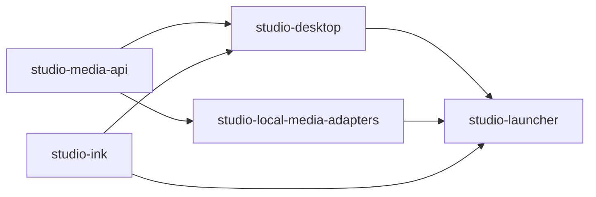

# Architecture overview

DocuPodcast Studio follows a layered local application architecture.

The capability cutover and the active third-tranche gates are recorded in the [refactoring roadmap](refactoring-roadmap.md). The component policy and native-dialog exceptions are defined in the [JavaFX design system](gui-design-system.md). Local diagnostics and recovery are described in [operations](../operations/diagnostics-and-recovery.md).

## Boundaries

- `domain` contains project, document, audio, visual, voice and theatre rules. It must not depend on JavaFX or infrastructure.
- `application` coordinates use cases and declares narrow ports. It must not depend on JavaFX, HTTP clients, processes, `Files`, `ImageIO` or PDF/runtime APIs.
- `infrastructure` implements persistence, local process, media and import/export ports.
- `presentation` owns JavaFX composition, narrow experience controllers and reusable GUI components. It must not perform I/O or know provider protocols.
- `bootstrap` is the composition root and may wire all layers.

Product-category workflows are explicit. Documentary, Narrative and Theatre may share transversal audio/video contracts, but Documentary and Narrative must not import Theatre implementation classes.

Project persistence is backward compatible. Refactors must preserve `.docupodcast.json`, relative project assets and existing example projects unless a separate migration is designed and tested.

Persistent video options and resolution values live in `domain.video`; audio formats and output path rules live in `domain.export`. Moving these value types does not change serialized field names or enum values.

Batch windows receive `BatchApplicationServices` from bootstrap. Official theatre package import uses `OfficialTheatrePackageAccess`, and package export receives `NarrationScriptWorkspaceRepository`. These ports keep adapter construction out of views and use cases.

## Long-running work

Voice synthesis, image generation, generative video and deterministic rendering use neutral contracts, shared resource scheduling, progress, cancellation and diagnostics. Views and application use cases do not invoke operating-system processes directly.

## Presentation

Reusable controls live under `presentation.components`, `presentation.ink`, `presentation.sidedock`, `presentation.ribbon` and related transversal packages. Category workspaces consume those controls instead of implementing parallel visual systems.

Product workspaces are derived from `ProjectExperience`; infrastructure needs are declared with extensible product-complexity requirements. Historical workspace identifiers are translated at the compatibility boundary and never determine the active product composition.
