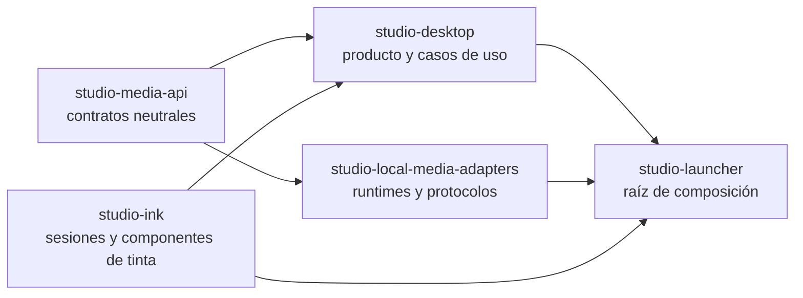

# Refactoring roadmap

Este documento fija los límites de la plataforma de capacidades y separa explícitamente la segunda y la tercera tanda. No es una lista de ideas: sirve como criterio de corte para evitar que una migración de infraestructura se mezcle con un rediseño de producto.

## Arquitectura resultante

El launcher es el único lugar que conoce simultáneamente desktop, tinta y adaptadores locales. La selección usa `EngineId`, `CapabilityId` y registros explícitos; no hay framework de inyección ni descubrimiento dinámico.

## Segunda tanda: alcance cerrado

La segunda tanda convierte los contratos creados inicialmente en la ruta productiva:

- Voz, imagen, video generativo y render determinista se registran como capacidades diferentes. `VIDEO_GENERATION` no se confunde con `VIDEO_RENDERING`.
- Las peticiones de medios, presets, referencias y artefactos son neutrales. Los nombres y workflows de un runtime quedan en sus adaptadores o en codecs de compatibilidad v1.
- El render final recibe un `VideoTimelinePlan` común con imágenes, clips, offsets, narración, overlays, fades y preferencia de codificación. Los comandos y codecs son responsabilidad del adaptador.
- Narrative genera imagen y clips mediante las capacidades registradas. El frame de continuidad es un artefacto explícito del video generativo.
- Voz admite lotes de `VoiceSynthesisUnit`; cada adaptador decide si itera o ejecuta un batch optimizado.
- `GenerationJobService` usa repositorio y scheduler inyectados, payloads tipados, adquisición ordenada de recursos, staging y promoción de artefactos.
- Los jobs nuevos se guardan en `jobs/generation/<capability>/<jobId>/job.json`. Los jobs antiguos son consultables y su reintento crea un job neutral nuevo sin modificar ni ejecutar el original.
- La administración de motores se dibuja desde descriptores: configuración, readiness, presets y acciones instalar/importar/iniciar/detener/reparar/probar comparten progreso, confirmación y cancelación.
- La presentación no recibe el localizador raíz de casos de uso. La composición entrega dependencias agrupadas por workspace.
- `studio-ink` es dueño de perfiles, input, coordenadas, historial, zoom, exportación y ciclo de vida. El catálogo y el registro de proveedores se construyen una vez en launcher.
- Las preferencias neutrales son `capability.voice.engine`, `capability.image.engine`, `capability.video.generation.engine` y `capability.video.render.engine`. Se siguen leyendo y escribiendo los aliases requeridos por `formatVersion: 1`.
- Los assets pesados permanecen en `models/`, `tools/` y `runtime/`; `RuntimeAssetCatalog` conserva el layout actual.

### Compatibilidad que no debe eliminarse todavía

- `.docupodcast.json` continúa en `formatVersion: 1` y todas las rutas de proyecto siguen siendo relativas.
- Los codecs aceptan perfiles, presets, settings y jobs anteriores. Un job histórico es de solo lectura.
- OCR/Tesseract queda aislado fuera del cutover de medios de esta tanda.
- Los smokes que necesitan runtimes reales son opt-in. Una instalación ausente se informa como recurso ausente, nunca como éxito simulado.
- Narrative mantiene su composición de producto actual y estado `EVOLVING`; la infraestructura nueva no decide su UX definitiva.

## Tercera tanda: trabajo deliberadamente diferido

La tercera tanda será de reducción de complejidad interna y robustez, no de ampliación de motores:

1. Dividir `DocuPodcastShellViewModel`, `DocuPodcastShellView`, `TechnicalProblemDialog`, `TheatreImageGenerationWorkspaceView` y `DocumentWorkspaceView` en controladores por experiencia y componentes con una responsabilidad.
2. Separar los grandes lectores y escritores JSON en codecs por sección, conservando indefinidamente la lectura y escritura compatible con v1.
3. Sacar la E/S general restante de los casos de uso, empezando por OCR/Tesseract y utilidades documentales.
4. Consolidar logging estructurado, métricas de jobs, diagnósticos exportables de soporte y eliminar el warning de SLF4J sin provider.
5. Ampliar pruebas JavaFX y E2E, navegación por teclado, accesibilidad, cierre abrupto, reanudación y recuperación de staging.
6. Revisar la composición UX de Narrative solo cuando existan criterios de producto estables. No se inferirá ese rediseño a partir del contrato de video generativo.
7. Medir acoplamiento, tiempos de compilación y superficie pública después de la segunda tanda. Solo con esos datos se evaluará una división física adicional de `studio-desktop`.

La tercera tanda no añadirá motores ni reabrirá los contratos públicos de medios salvo que un contract test reproduzca un defecto que no pueda resolverse en un adaptador.

## Regla para nuevas composiciones

Una nueva experiencia de dibujo registra un `DrawingProfile`, sus overlays y paneles específicos. No vuelve a implementar captura, presión, transformación de coordenadas, zoom, undo/redo, restauración, exportación ni cierre del proveedor.

Un nuevo adaptador de una capacidad existente implementa su contract test, publica descriptor/presets/administración y se registra en launcher. No modifica dominio, workflows de producto ni componentes GUI.
