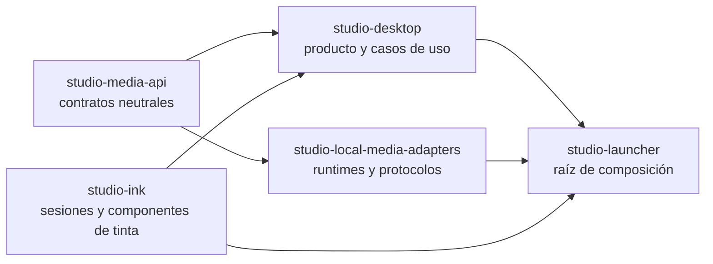

# Refactoring roadmap

Este documento fija los límites de la plataforma de capacidades y separa explícitamente la segunda y la tercera tanda. No es una lista de ideas: sirve como criterio de corte para evitar que una migración de infraestructura se mezcle con un rediseño de producto.

## Arquitectura resultante

El launcher es el único lugar que conoce simultáneamente desktop, tinta y adaptadores locales. La selección usa `EngineId`, `CapabilityId` y registros explícitos; no hay framework de inyección ni descubrimiento dinámico.

## Segunda tanda: alcance cerrado

La segunda tanda convierte los contratos creados inicialmente en la ruta productiva:

- Voz, imagen, video generativo y render determinista se registran como capacidades diferentes. `VIDEO_GENERATION` no se confunde con `VIDEO_RENDERING`.
- Las peticiones de medios, presets, referencias y artefactos son neutrales. Los nombres y workflows de un runtime quedan en sus adaptadores o en codecs de compatibilidad v1.
- El render final recibe un `VideoTimelinePlan` común con imágenes, clips, offsets, narración, overlays, fades y preferencia de codificación. Los comandos y codecs son responsabilidad del adaptador.
- Narrative genera imagen y clips mediante las capacidades registradas. El frame de continuidad es un artefacto explícito del video generativo.
- Voz admite lotes de `VoiceSynthesisUnit`; cada adaptador decide si itera o ejecuta un batch optimizado.
- `GenerationJobService` usa repositorio y scheduler inyectados, payloads tipados, adquisición ordenada de recursos, staging y promoción de artefactos.
- Los jobs nuevos se guardan en `jobs/generation/<capability>/<jobId>/job.json`. Los jobs antiguos son consultables y su reintento crea un job neutral nuevo sin modificar ni ejecutar el original.
- La administración de motores se dibuja desde descriptores: configuración, readiness, presets y acciones instalar/importar/iniciar/detener/reparar/probar comparten progreso, confirmación y cancelación.
- La presentación no recibe el localizador raíz de casos de uso. La composición entrega dependencias agrupadas por workspace.
- `studio-ink` es dueño de perfiles, input, coordenadas, historial, zoom, exportación y ciclo de vida. El catálogo y el registro de proveedores se construyen una vez en launcher.
- Las preferencias neutrales son `capability.voice.engine`, `capability.image.engine`, `capability.video.generation.engine` y `capability.video.render.engine`. Se siguen leyendo y escribiendo los aliases requeridos por `formatVersion: 1`.
- Los assets pesados permanecen en `models/`, `tools/` y `runtime/`; `RuntimeAssetCatalog` conserva el layout actual.

### Compatibilidad que no debe eliminarse todavía

- `.docupodcast.json` continúa en `formatVersion: 1` y todas las rutas de proyecto siguen siendo relativas.
- Los codecs aceptan perfiles, presets, settings y jobs anteriores. Un job histórico es de solo lectura.
- OCR/Tesseract queda aislado fuera del cutover de medios de esta tanda.
- Los smokes que necesitan runtimes reales son opt-in. Una instalación ausente se informa como recurso ausente, nunca como éxito simulado.
- Narrative mantiene su composición de producto actual y estado `EVOLVING`; la infraestructura nueva no decide su UX definitiva.

## Tercera tanda: saneamiento final en ejecucion

La tercera tanda se ejecuta en cinco gates consecutivos. Un gate no se considera cerrado por crear contratos: la ruta productiva y sus pruebas deben usarlo.

1. **Cierre de infraestructura heredada.** Los protocolos, procesos, HTTP, descargas, PDF/OCR y manipulacion multimedia salen de `application` y `presentation`. Los nombres de proveedor solo permanecen en adaptadores, launcher y codecs de compatibilidad.
2. **Cutover de presentacion.** `StudioSessionStore` conserva exclusivamente el estado global. Proyecto, reproduccion, documento, Documentary, Theatre, Narrative, exportacion y administracion poseen controladores estrechos. Las vistas raiz solo componen layout y bindings.
3. **Persistencia seccionada.** `DocuPodcastProjectJsonReader` y `DocuPodcastProjectJsonWriter` coordinan codecs de metadata, lectura, voz, assets, estudio, Theatre, Narrative y vista sin modificar `formatVersion: 1`.
4. **Operabilidad local.** SLF4J/Logback, contexto MDC, metricas de jobs, ZIP de soporte sanitizado, cierre ordenado y reconciliacion de jobs interrumpidos forman una unica politica de operacion.
5. **Verificacion.** La suite normal, `gui-e2e`, empaquetado y smoke del launcher son obligatorios. Las reglas arquitectonicas impiden reintroducir las dependencias retiradas.

### Contratos internos de esta tanda

- `StudioSessionStore`: proyecto activo, experiencia, seleccion transversal, dirty y mensajes.
- `ProjectArtifactStore`, `DocumentAssetGateway`, `ArchiveGateway`, `DocumentTextExtractor` y `DocumentTextExtractionProvisioner`: E/S especializada; no existe una fachada global de sistema de archivos.
- `OperationContext`, `JobMetricsRecorder`, `ApplicationLifecycleCoordinator` y `SupportBundleExporter`: operabilidad local y sanitizada.
- `ProjectJsonSectionCodec`: lectura/escritura por seccion con contextos compartidos y aliases v1 centralizados.

Los contratos publicos de voz, imagen, video generativo y render permanecen congelados. Un cambio requiere primero un contract test que reproduzca el defecto.

### Recuperacion y privacidad

En cierre normal se bloquean jobs nuevos, se solicita cancelacion, se espera hasta cinco segundos, se persiste estado y finalmente se cierran tinta, runtimes, ejecutores y logging. Al arrancar, un job neutral `RUNNING` o `STAGING` pasa a `INTERRUPTED/RECOVERABLE`; los jobs historicos no se reescriben.

Logs y bundles de soporte no contienen prompts completos, texto documental, secretos, query strings, proyectos, modelos ni artefactos. Las rutas de home y proyecto se tokenizan. No existe subida automatica.

### Estado de corte

- Cerrado: codecs JSON v1 por seccion, logging runtime, contexto operativo, bundle sanitizado, coordinador de ciclo de vida, recuperacion neutral de jobs y perfil JavaFX headless.
- Cerrado en presentacion: la administracion de voz usa descriptores neutrales; Theatre genera por capacidades neutrales; los nombres de proveedor, clientes HTTP y `ImageIO` estan prohibidos por pruebas de frontera.
- Cerrado en tinta transversal: `InkCanvasViewport` centraliza el target transparente, coordenadas y limites vivos; `InkEditorSession` conserva presion cruda/normalizada, zoom, historial y ciclo de vida. Problema tecnico, composicion libre y frame teatral consumen esa ruta y los perfiles crecientes ya no se limitan al ancho inicial.
- En curso: retirada de rutas heredadas de generacion/documentos, E/S directa restante y descomposicion de controladores/vistas. Narrative ya resuelve y descarta artefactos mediante `ProjectArtifactStore`; quedan otros workspaces por migrar.
- Evidencia del 21 de julio de 2026: `mvn verify -Pgui-e2e` paso con 889 pruebas normales, 0 fallos, 0 errores y 1 omitida, mas 4 pruebas JavaFX headless. La verificacion focalizada posterior del skin de formularios paso 2 reglas de arquitectura y 5 pruebas JavaFX headless.
- Pendiente para el gate final: eliminar `DocuPodcastShellViewModel`, reducir las cuatro vistas grandes a composicion, sacar los 148 accesos `Files.*` que aun permanecen en presentacion, retirar E/S/procesos documentales de application y completar el smoke interactivo del launcher.

### Alcance detallado

La tercera tanda será de reducción de complejidad interna y robustez, no de ampliación de motores:

1. Dividir `DocuPodcastShellViewModel`, `DocuPodcastShellView`, `TechnicalProblemDialog`, `TheatreImageGenerationWorkspaceView` y `DocumentWorkspaceView` en controladores por experiencia y componentes con una responsabilidad.
2. Separar los grandes lectores y escritores JSON en codecs por sección, conservando indefinidamente la lectura y escritura compatible con v1.
3. Sacar la E/S general restante de los casos de uso, empezando por OCR/Tesseract y utilidades documentales.
4. Consolidar logging estructurado, métricas de jobs, diagnósticos exportables de soporte y eliminar el warning de SLF4J sin provider.
5. Ampliar pruebas JavaFX y E2E, navegación por teclado, accesibilidad, cierre abrupto, reanudación y recuperación de staging.
6. Revisar la composición UX de Narrative solo cuando existan criterios de producto estables. No se inferirá ese rediseño a partir del contrato de video generativo.
7. Medir acoplamiento, tiempos de compilación y superficie pública después de la segunda tanda. Solo con esos datos se evaluará una división física adicional de `studio-desktop`.

La tercera tanda no añadirá motores ni reabrirá los contratos públicos de medios salvo que un contract test reproduzca un defecto que no pueda resolverse en un adaptador.

## Regla para nuevas composiciones

Una nueva experiencia de dibujo registra un `DrawingProfile`, sus overlays y paneles específicos. No vuelve a implementar captura, presión, transformación de coordenadas, zoom, undo/redo, restauración, exportación ni cierre del proveedor.

Un nuevo adaptador de una capacidad existente implementa su contract test, publica descriptor/presets/administración y se registra en launcher. No modifica dominio, workflows de producto ni componentes GUI.

## Tanda de arranque confiable y paridad

Esta tanda corrige el camino ejecutable antes de continuar la reducción de clases grandes:

- `studio-launcher` exporta cualificadamente su clase JavaFX y el smoke muestra el shell real antes de cerrar.
- `LocalMediaLayout` separa instalación de runtime escribible. Propiedad Java, entorno y detección tienen precedencia documentada; `user.dir` deja de ser infraestructura implícita.
- Piper, XTTS, ComfyUI imagen, ComfyUI video y FFmpeg poseen administradores propios. Ningún formulario administrativo acepta comandos, destinos o staging arbitrarios.
- El runtime ComfyUI se inicia una vez aunque imagen y video conserven registros y contratos independientes.
- El catálogo público se reduce a siete scripts. La app-image es ligera; MSI y copia de activos pesados quedan fuera de alcance.
- La copia `g - copia` es un oráculo estrictamente de solo lectura. La [matriz de paridad](../quality/capability-parity.md) relaciona activos, rutas productivas y evidencia.

El gate no afirma que un recurso ausente exista: los workflows de video no incluidos en la referencia deben importarse desde Configuración y hasta entonces se informan como capacidad no disponible.
