# Índice de referencias visuales capturadas durante el rediseño

Este directorio conserva las capturas que se usaron durante la planificación del rediseño de DocuPodcast Studio. La intención es que cualquier conversación futura, auditoría o tanda posterior pueda reconstruir el contexto visual sin depender de capturas sueltas fuera del repositorio.

## Regla de uso

Estas imágenes son **referencias de producto y UX**, no activos finales de la aplicación. Sirven para entender decisiones sobre navegación, jerarquía visual, barras, sidebars, hoja central, paneles contextuales y limpieza del workspace Documento.

## Mapa de carpetas

```text

docs/referencias/capturas-chat/
├── app-docupodcast/
│   ├── 01_docupodcast_inicio_pre_t81.png
│   ├── 02_docupodcast_documento_top_pre_t81.png
│   ├── 03_docupodcast_documento_seleccion_pre_t81.png
│   ├── 04_docupodcast_narracion_avanzada_pre_t81.png
│   ├── 05_docupodcast_guia_markdown_pre_t81.png
│   ├── 06_docupodcast_configuracion_tts_pre_t81.png
│   ├── 07_docupodcast_documento_paneles_pre_t81.png
│   └── 08_docupodcast_documento_seleccion_metadata_pre_t81.png
├── referencias-externas/
│   ├── 01_xournal_lienzo_limpio_miniaturas.png
│   ├── 02_wps_toolbar_iconos_documento_pdf.png
│   ├── 03_wps_documento_limpio.png
│   ├── 04_blender_layout_general.png
│   ├── 05_blender_panel_propiedades_compacto.png
│   ├── 06_blender_sidebar_contextual.png
│   └── 07_blender_paneles_laterales.png
├── retroalimentacion-t81/
│   ├── 01_configuracion_no_debe_estar_en_inicio.png
│   ├── 02_barra_flotante_lectura_comprimida.png
│   └── 03_layout_t81d_sidebars_y_documento.png
└── contact_sheet_referencias_visuales.png
```

## Lectura de las capturas de DocuPodcast

### Inicio y bienvenida pre-T81

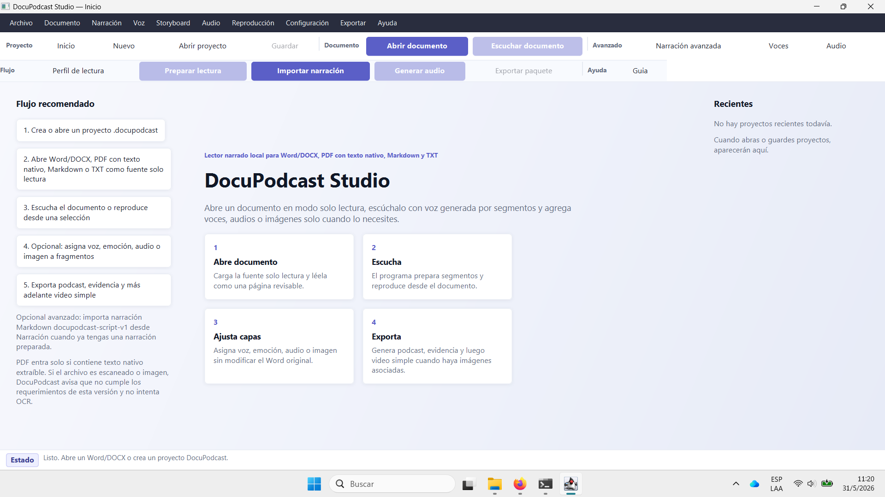

Esta captura documenta el estado inicial donde la bienvenida todavía competía con acciones técnicas, flujo recomendado y accesos que no debían estar todos visibles. Sirvió para decidir que la pantalla de inicio debe ser una superficie de presentación del producto: **Abrir documento, Abrir proyecto, Nuevo proyecto, Recientes y flujo simple**.

### Documento antes de limpiar metadatos

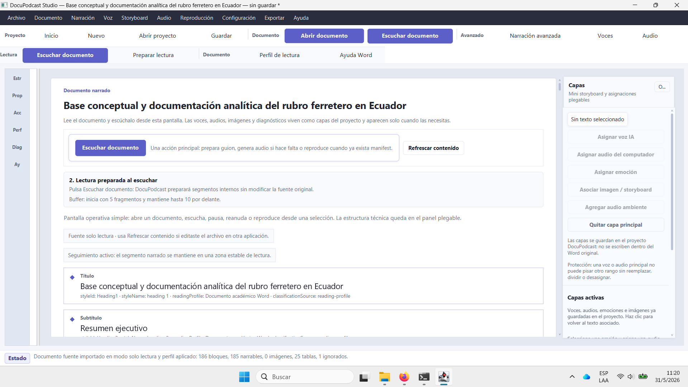

Esta captura muestra que Documento ya tenía una intención correcta, pero todavía había demasiada explicación técnica. El objetivo posterior fue separar: centro para leer/escuchar, inspector izquierdo para operar el fragmento, rail derecho para miniaturas.

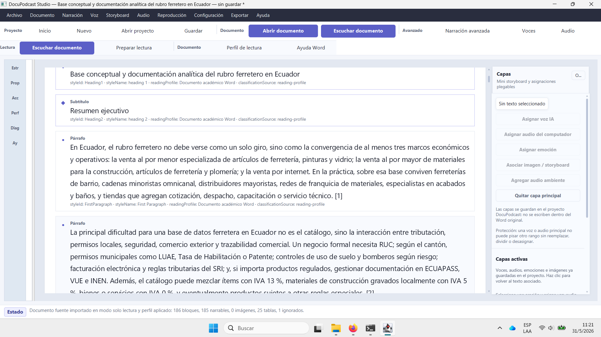

Esta captura evidencia que el usuario podía seleccionar texto y que existía seguimiento visual, pero también muestra que la interfaz aún cargaba demasiadas capas, paneles y diagnósticos alrededor de la hoja.

### Narración avanzada y guía técnica

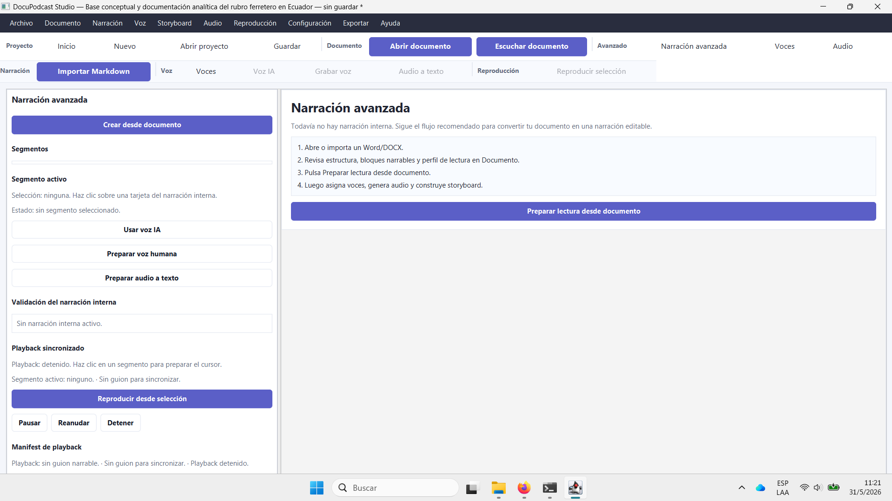

Esta vista sirvió para confirmar que **Narración avanzada** no debe ser superficie principal. Puede existir como herramienta avanzada, pero no debe competir con Documento.

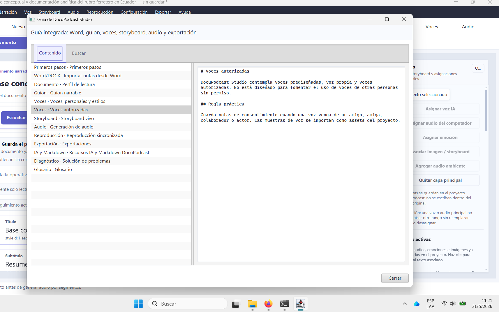

La guía en formato Markdown crudo fue útil para desarrollo, pero no para una ayuda final. Debe evolucionar a ayuda de producto con pasos, tarjetas y lenguaje de usuario.

### Configuración pre-T81

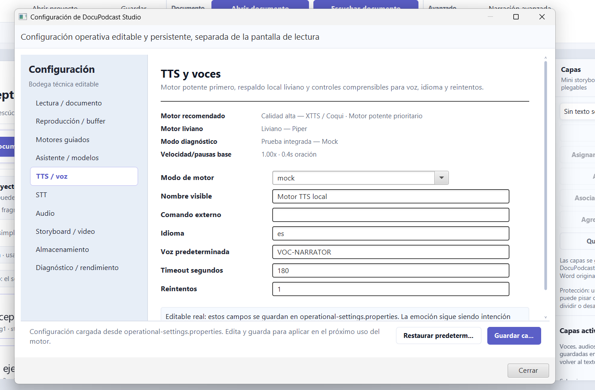

Esta captura confirma que Configuración puede ser técnica, pero debe vivir como ventana propia accesible desde el menú **Configuración**. No debe invadir el workspace Documento ni aparecer en la pantalla de inicio como tarjeta promocional.

### Documento con paneles técnicos

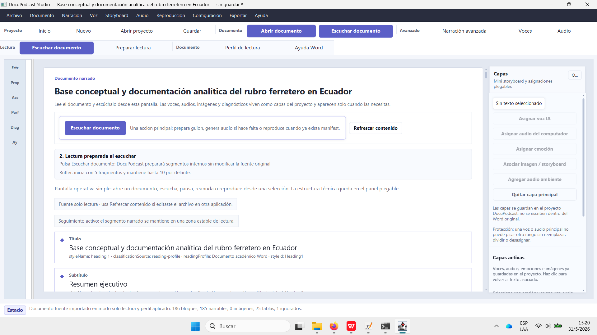

Captura usada para decidir el modelo de tres regiones: inspector izquierdo, documento central y rail derecho.

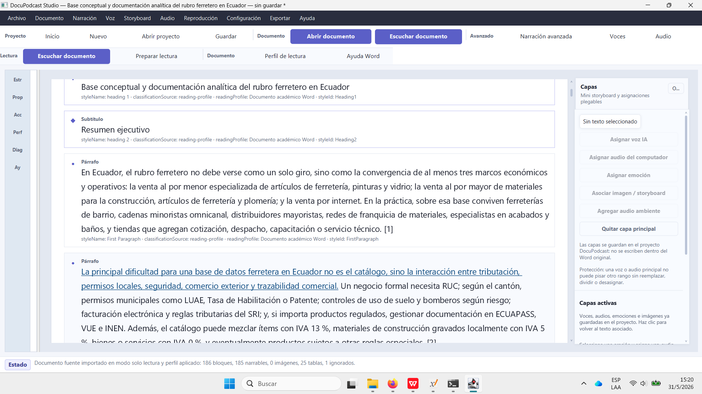

Esta captura justificó T81B: quitar `styleName`, `styleId`, `readingProfile`, `classificationSource`, `FirstParagraph` y metadatos similares del lector central. Esos datos deben estar en Detalles técnicos o Diagnóstico, no en la hoja.

## Referencias externas

### Xournal++

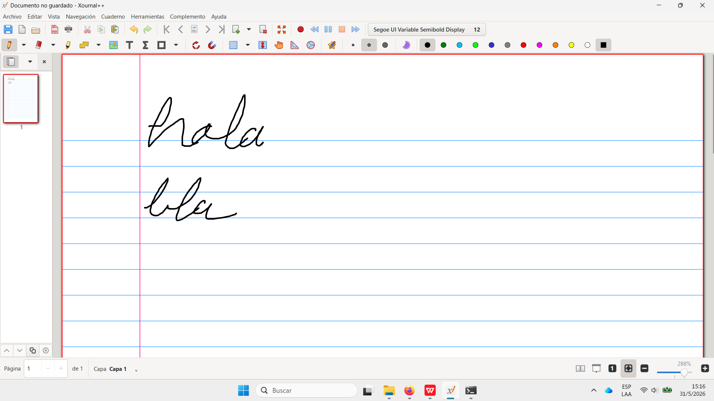

Referencia para una hoja central limpia con un rail de miniaturas. La lección aplicada a DocuPodcast: el usuario debe concentrarse en el contenido, no en la infraestructura.

### WPS Office

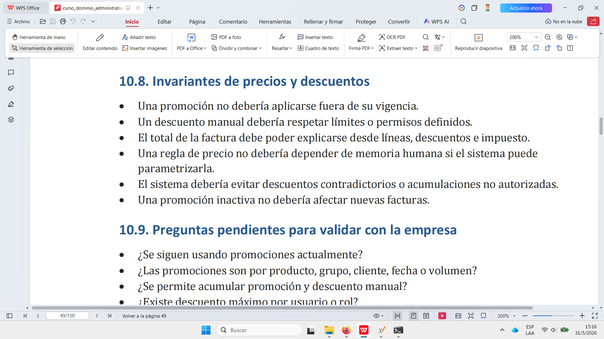

Referencia para toolbar con iconos, grupos y acciones respiradas. La lección aplicada a DocuPodcast: evitar filas de botones textuales grandes sin jerarquía.


Referencia para lectura limpia. La lección aplicada: Documento debe mostrar títulos, subtítulos, párrafos y selección; no debe imprimir metadatos técnicos.

### Blender

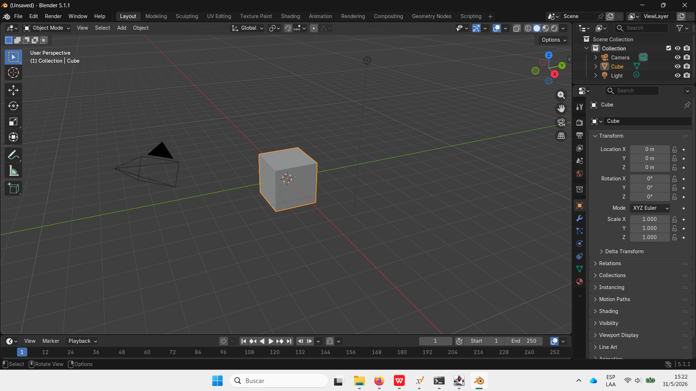

Referencia para una aplicación compleja con paneles potentes, pero jerarquizados. La lección aplicada: DocuPodcast puede tener inspector contextual y rail visual sin saturar la hoja central.

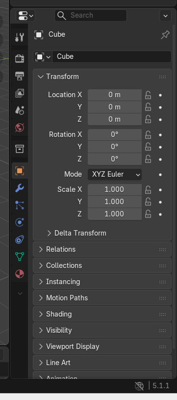

Referencia directa para el inspector lateral: categorías, módulos colapsables, propiedades contextuales.

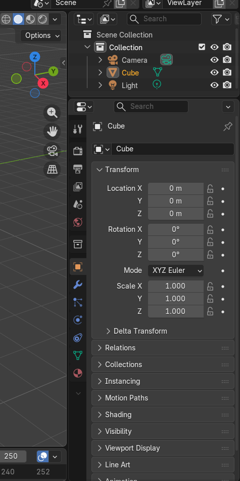

Referencia para ubicar acciones contextuales cerca de la selección sin convertir la toolbar en cabina técnica.

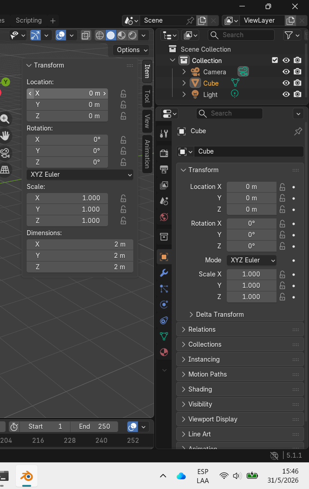

Referencia para coexistencia de paneles izquierdo/derecho con un centro operativo dominante.

## Retroalimentación T81

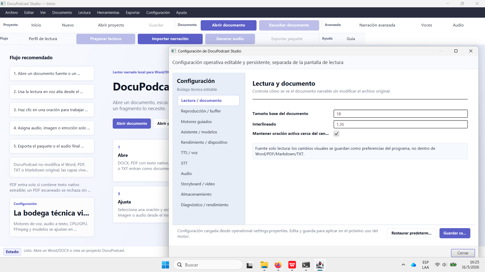

Esta captura motivó la regla: **Configuración solo desde el menú Configuración**. La bienvenida no debe vender la bodega técnica.

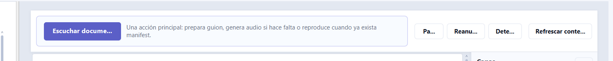

Esta captura motivó compactar la barra flotante: el texto explicativo debe vivir como tooltip, no como texto permanente que comprime Pausar/Reanudar/Detener/Refrescar.

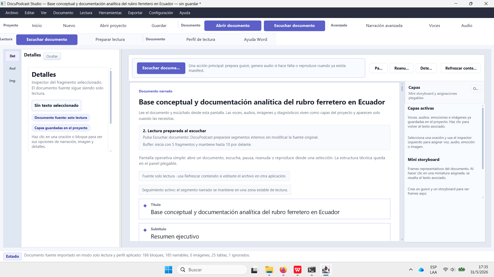

Esta captura documenta el estado con sidebars y refuerza la regla estructural: izquierda opera fragmento, centro lee/escucha, derecha navega visualmente.

## Decisiones visuales derivadas

1. El centro de la app es **Documento**, no Guion, Audio, Storyboard ni Configuración.
2. El usuario normal trabaja así: abre documento, escucha, selecciona oración, ajusta audio/imagen/emoción si necesita, exporta.
3. El menu bar debe ser común y sobrio.
4. La toolbar debe usar iconos, grupos y textos cortos.
5. El texto largo de ayuda debe ir en tooltip, guía o configuración; no en el workspace principal.
6. Los metadatos técnicos del documento no pertenecen a la hoja.
7. Las acciones por fragmento viven en el inspector izquierdo.
8. El rail derecho es visual/navegacional, no formulario de configuración.
9. Configuración es la bodega técnica y solo se abre desde su menú.
10. Las vistas secundarias siguen como avanzadas, pero no como navegación primaria.

